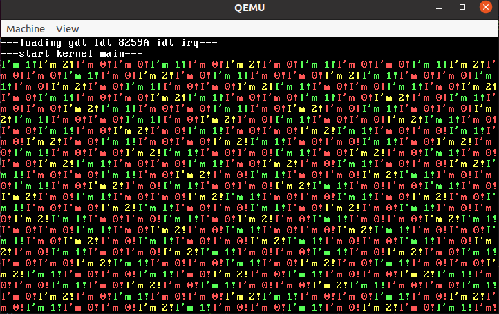
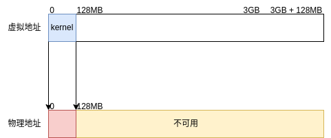
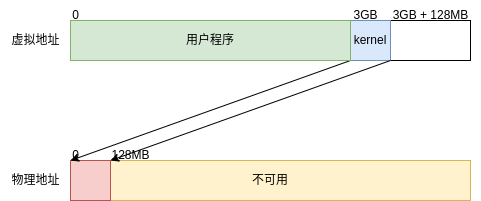

<div align='center'>
    <font size='6'>实验五 系统调用、页表</font>
</div>

<div align='center'>
    <font size='4'>谷建华</font>
</div>

<div align='center'>
    <font size='4'>2022-10-28 v0.3</font>
</div>

#### 实验目的

1. 学习用户态执行系统调用到内核态处理的整个过程.
2. 学习页表,理解如何从线性地址经过页表映射到物理地址实现进程间的内存资源隔离.
3. 学习页表项相关位的功能,如何维护页表数据结构.

#### 实验预习内容

1. 系统调用规范.
2. 页表数据结构.
3. 页表项的组成.

#### 实验内容

1. 补全`main.c`中的代码,为每个用户进程加载在磁盘中的ELF程序文件到用户地址空间.
   (1) `main.c`中用户态的程序加载方式由原先加载kernel中的函数变成加载用户ELF文件的方式,你需要添加相应代码实现用户态程序加载功能.
   (2) 我们将文件系统读取函数`read_file`准备好,给定短目录项名和加载的地址该函数会将指定文件加载到地址中.
   (3) 我们将内核段地址映射函数`map_kern`准备好,它会将`3GB + 0MB ~ 3GB + 128MB`的线性地址（内存分布模型见实验参考最后一节）映射到`0MB ~ 128MB`的物理地址,供大家学习页表的初始化过程.
   (4) `phy_malloc_4k`是一个非常简单的内存分配函数,它会分配物理地址`64MB ~ 128MB`区间的的内存,每次分配4KB,一个页面大小（暂时可以不用考虑内存回收的情况,只需要光分配就行了）.
   (5) 你需要做的是将用户ELF文件从文件系统中读取,并解析ELF文件将程序段正确加载到每个进程中的地址空间,使得能够运行用户态程序.我们准备了两个用户测例文件`testpid.bin`和`testkey.bin`,第一个测试`get_pid`系统调用,第二个测试键盘输入,**需要验证两个程序能够并发地执行**.
   (6) 如果你在实现中遇到了`Page Fault`,那么基本上意味着你加载错了,这个时候请根据报错的`eip`信息（pc程序计数器）然后对ELF文件进行反汇编将触发错误的指令找到,必要的时候需要通过`gdb`一条汇编一条汇编地执行直到找到问题.跟页表打交道非常容易出现这种问题,请耐心调试.
2. 添加`delay_ticks`系统调用.
   (1) `delay_ticks`的系统调用的C语言语义如下：
   ```C
    // 进程休眠ticks个时钟中断
    // 系统调用默认返回0
    ssize_t delay_ticks(u32 ticks);
   ```
   (2) `delay_ticks`的系统调用号自行定义,你需要写在内核`kern/syscall.c`和用户`lib/user/syscall.c`的两部分的接口.
   (3) 在`user/delay.c`存放着测试该系统调用的代码,而`delay_ticks`函数被注释掉了（我们并没有给出函数接口）,你需要在实现对应接口后取消注释测试用户程序`delay.bin`.
   (4) 你需要开三个用户进程同时执行`delay.bin`,这三个用户进程的pid号分别为`0,1,2`,`delay.bin`会获取进程pid号来给出休眠的时长.预计效果图如下：

    

   (5) 你需要注意一个边界情况：当三个进程都休眠了,你怎么解决？谁接替执行流？或是干脆休眠核让执行流干脆不执行直到下个中断？
3. (自我提高内容,自己想做就做,不用写进报告,**禁止内卷**)添加`mmap`系统调用对贪吃蛇程序`snake.bin`进行数据注入.
   (1) 你还记得实验四的贪吃蛇吗？还是这个程序,不过这次这个程序抽风了,它的食物出现在了地图外,那岂不是永远无法游玩了？不过好在天无绝人之路,善良的设计者设计食物结构体结构如下：
   ```c
   struct Food {
        char hint[16];
        int x;
        int y;
        int score;
   };

   struct Food food = {
        .hint = "This is a food",
        //...
   };
   ```
   food的值会放在elf的data段中,相信根据elf文件的信息和上面的初始化内容你能够找到food在内存中的地址.
   (2) 编写`mmap`系统调用,其C语言语义如下（非官方语义,也可以自行设计其他语义解释）：
   ```c
    // 将pid号进程的线性地址[src, src + length)中的页面共享到该进程的线性地址[dst,  dst + length)
    // src,length和dst需要4096对齐
    // 由于是自行实现的,没有过多的要求.
    ssize_t mmap(int pid, void *src, size_t length, void *dst);
   ```
   自行写一个hack程序,在`main.c`中创建两个用户进程`snake.bin`和自己的hack程序,hack程序通过调用`mmap`系统调用跟`snake.bin`的部分内存共享,然后hack程序修改`food`的数据让食物回到地图内（每帧会重新绘制地图）.这样就可以重新游玩贪吃蛇.

#### 实验总结

1. 系统调用的入口参数是如何传入内核的？返回值又是如何返回给进程的？
2. 时钟中断和系统调用对IDT的初始化有什么不同？
3. 该实验中初始化内核页表和用户页表有啥区别？

#### 实验参考

##### 系统调用

在上一个实验中,我们可以调用`kprintf`函数实现输出的功能,我们仅仅实现了一个“虚假”的用户态,虽然段寄存器的权限在用户态,但是我们依然能够调用kernel中的函数,但是这么做有一个弊端,用户态下能够轻易调用内核的函数,这是我们所不希望的,所以我们通过页表将进程资源隔离,通过页表给用户进程戴上一个VR眼镜,这样用户进程在执行的时候就看不到内核的函数.

但是`printf`是需要向终端输出字符的,但是终端显示被内核所掌控,这个时候用户就需要使用系统调用向内核请求服务.简单理解就是用户做不了的需要向内核申请服务.

系统调用类似函数调用,不过它是跨越权限的,系统调用也有它的一套规范,这套规范可以阅读`man syscall`手册查看,下面是调用规范的部分截取.

```
Architecture calling conventions
    Every architecture has its own way of invoking and passing arguments to
    the  kernel.   The  details for various architectures are listed in the
    two tables below.

    The first table lists the instruction used to transition to kernel mode
    (which  might  not be the fastest or best way to transition to the ker‐
    nel, so you might have to refer to vdso(7)), the register used to indi‐
    cate  the system call number, the register(s) used to return the system
    call result, and the register used to signal an error.

    Arch/ABI    Instruction           System  Ret  Ret  Error    Notes
                                      call #  val  val2
    ───────────────────────────────────────────────────────────────────
    alpha       callsys               v0      v0   a4   a3       1, 6
    arc         trap0                 r8      r0   -    -
    arm/OABI    swi NR                -       a1   -    -        2
    arm/EABI    swi 0x0               r7      r0   r1   -
    arm64       svc #0                x8      x0   x1   -
    blackfin    excpt 0x0             P0      R0   -    -
    i386        int $0x80             eax     eax  edx  -
```

###### 系统调用汇编命令

看最后一行,我们可以获悉linux对i386架构是调用`int $0x80`汇编指令进行系统调用,调用这条指令后就可以直接进内核态进行系统调用处理.

在之前的学习中,我们知道`int`的命令实际上是触发中断,后面跟着的数字是中断号,所以在i386架构中,系统调用本质上跟中断类似,不过不是由硬件触发是由用户自己调用触发.如果愿意,我们可以修改系统调用的中断号,只要不发生冲突就行.

```c
// 在start.c中系统调用初始化
// INT_VECTOR_SYSCALL值可以任意,这次的实验用的是linux的0x80
init_gate(idt + INT_VECTOR_SYSCALL,	DA_386IGate,
            int_syscall,		PRIVILEGE_USER);
```

###### 系统调用号

但是要知道内核可不只有一种功能,如何获悉用户想要哪种功能就看下一列`System call #`,可以知道内核是根据`eax`寄存器的值获悉用户需要哪种功能,这个值就叫系统调用号.

系统调用号可以有很多种规范,相同的系统调用号在不同的规范下内核会实现不同的功能,我们的实验用是自创教学用的规范,专业标准的是叫POSIX（可移植操作系统接口）规范,它的一部分是对于系统调用号对应的功能进行定义,这样只要遵循的相同的系统调用规范就能让一个相同的用户程序在不同的操作系统上运行.在`man syscalls`手册中有写到：linux的系统调用号在64位机器上系统调用号在`/usr/include/asm/unistd_64.h`文件中,数了数有四百多个,量可以说是相当大了.

###### 系统调用其余参数

系统调用可不光有一个系统调用号,它还可以附带一些参数,我们继续在`man syscall`中阅读可以看到这么一段：

```
The second table shows the registers used to pass the system call argu‐
ments.

    Arch/ABI      arg1  arg2  arg3  arg4  arg5  arg6  arg7  Notes
    ──────────────────────────────────────────────────────────────
    alpha         a0    a1    a2    a3    a4    a5    -
    arc           r0    r1    r2    r3    r4    r5    -
    arm/OABI      a1    a2    a3    a4    v1    v2    v3
    arm/EABI      r0    r1    r2    r3    r4    r5    r6
    arm64         x0    x1    x2    x3    x4    x5    -
    blackfin      R0    R1    R2    R3    R4    R5    -
    i386          ebx   ecx   edx   esi   edi   ebp   -
```

看最后一行,可以知道系统调用是由`ebx`, `ecx`, `edx`, `esi`, `edi`, `ebp`这六个寄存器传递参数.不像正常的函数调用传参靠栈,而是靠寄存器传递参数,而且最多只能传递6个,如果要传递复杂的结构可以考虑传入结构体指针的方式解决.

虽然上面的规范如此,但是没有定死,我们完全可以将`ebx`作为系统调用号,`eax`作为参数,不过这么做有点吃饱了撑着不去兼容规范.

###### 系统调用返回值以及错误码

再看第一张表的`Retval`,可以获悉到系统调用也是可以有返回值的,返回值一般放在`eax`寄存器,当`eax`寄存器放不下的时候会将第二部分放`edx`,但是这种情况比较罕见,所以暂且不用去理会.

系统调用的返回值与普通函数的返回值中不太一样的一点是它会返回错误号,错误号是一类特殊的返回值,当用户请求的系统调用正确时会返回0或系统调用规定的值,但有错误（常见的比如文件路径不存在,用户越权写系统文件）时系统调用会返回错误号,错误号值的范围从-1,-2,-3...以此类推,大概有一百来个.通过错误号,用户可以知道自己调用系统调用触发了什么问题,可以阅读`man errno`手册可以获得错误号对应的语义.在终端中输入错误命令或在平常C语言代码中调用`perror`函数输出的都是根据上一个系统调用的错误码信息输出相应的字符串.

```
$ ls
cstat  cstat.c
$ stat 114514
stat: cannot stat '114514': No such file or directory
$ cat cstat.c
// 你如果要问我怎么知道要引入这些头文件的,直接man翻手册啊
// 正经人谁背的住那么多头文件,不如直接翻手册
#include <sys/types.h>
#include <sys/stat.h>
#include <unistd.h>
#include <stdio.h>

int main()
{
	struct stat statbuf;
	stat("1919810", &statbuf);
	perror("");
}
$ ./cstat
No such file or directory
```

就如上面的例子,两个都是访问的不存在的文件,获取到的错误码信息为ENOENT,具体值在POSIX中值被规定成了2,相当于系统调用返回-2,它的语义就是`No such file or directory`,所以两个命令都输出了这句话.

由于错误码有限多个,所以同一个错误码在不同系统调用中有不同的语义,你如果会去翻系统调用的手册的时候会经常发现ERRORS这一栏,这里定义了一系列可能出现的问题以及会返回的对应错误码.

###### 如何获取程序用到的系统调用

当你在终端中输入一行命令后发现它报错了,你肯定会很疑惑它为什么会这么报错,这个时候一种可行的做法就是使用`strace`命令,它会截获用户程序对应的系统调用.

```shell
$ strace stat ./114514
# strace 输出的东西太多,就截取跟114514相关的
execve("/usr/bin/stat", ["stat", "./114514"], 0x7ffc75313828 /* 66 vars */) = 0 
lstat("./114514", 0x7ffca6294210)       = -1 ENOENT (No such file or directory)
write(2, "cannot stat './114514'", 22)  = 22
```

根据strace的结果可以知道哪些系统调用发生了异常,上面可以知道`lstat`这个系统调用发生了异常,返回了ENOENT,用户程序可以通过其系统调用了解其实际干了什么,这也是一种猜测用户行为debug的一种方式.

###### MINIOS系统调用处理逻辑

对于我们实验的代码,系统调用分成三步处理：

+ `sys_*` 第一层处理函数,获取系统调用中需要的寄存器参数丢给下一层处理
+ `do_*` 第二层处理函数,会将参数做一些转换和边界判断丢给下一层处理.
+ `kern_*` 第三层处理函数,也是实际处理函数,因为学生开发总是稀里糊涂的乱用处理函数,规定在内核中如果只能调用`kern_*`处理语义相同的功能.

这三层在代码中可以体现,整个中断的处理流程跟时钟中断非常类似,还要简单.

```nasm
; atrap.asm中的系统调用处理函数
; 相比于硬件中断这段代码可太简单了
int_syscall:
	call	save
	sti
	call	syscall_handler
	cli
	ret
```

进内核态后先保存用户程序上下文（寄存器）,然后调用`syscall_handler`函数进行处理,处理完毕后返回用户态,就这么简单.

`syscall_handler`仅仅是根据系统调用号判断该用什么处理函数.

```c
static ssize_t sys_get_ticks(void);
static ssize_t sys_get_pid(void);
static ssize_t sys_read(void);
static ssize_t sys_write(void);
// 这是种有趣的写法,举个例子
// 这种写法钦定了syscall_table的第_NR_get_ticks项与sys_get_ticks函数绑定
ssize_t (*syscall_table[])(void) = {
[_NR_get_ticks]	sys_get_ticks,
[_NR_get_pid]	sys_get_pid,
[_NR_read]	sys_read,
[_NR_write]	sys_write,
};

/*
 * 系统调用处理函数
 */
void
syscall_handler()
{
	int syscall_id = p_proc_ready->pcb.user_reg.eax;
	ssize_t ret = (*syscall_table[syscall_id])();
	// 将用户态的寄存器值修改,在返回用户态时返回值就自然被写到了eax上
	p_proc_ready->pcb.regs.eax = ret;
}
```

##### 页表

在实验三,我们实际上已经引入了页表用于扩展地址空间,将由实模式的段偏移寻址模式变为页表寻址增加寻址能力,但是页表映射是恒等映射,让你们觉得好像内存哪里都能访问.

###### 线性地址和物理地址

我们平时写的程序访问地址都是访问线性地址,线性地址是不用关心物理内存的约束,也就是意味着我们内存128MB的虚拟机,你可以尝试访问1GB处的线性地址,如果换成物理地址,你只能访问128MB以内的地址.

我们访问线性地址,实际上也是在访问内存中的某处的物理地址,通过页表这个数据结构将线性地址转化为物理地址,就仿佛带了个VR眼镜,你觉得你能够看到某处线性地址,但是它实际上被VR眼镜转化到某一物理地址去了,同理你带不同的VR眼镜,相同的线性地址被解析成了不同的物理地址,每个进程能够访问到的物理内存地址范围互不相同,除非通过特殊手段,一个进程是不能访问到另一个进程的地址空间,这样就实现了进程资源之间的地址空间隔离.

###### VR眼镜（cr3）

在i386架构采用三级页表模式：页目录、页表和物理页（这个下文会慢慢解释）,cr3中存放了页目录的地址.而这个cr3寄存器,它的意义就如上文提到的VR眼镜,每一个进程会维护一个cr3的值,代表进程的地址空间,每当进程发生调度的时候,新的进程会使用`lcr3`函数将cr3寄存器值更新,相当于将cr3的值mov过去,具体见执行代码,相当于换VR眼镜的过程.

###### 线性地址转换到物理地址

好了,到了最麻烦的一部分,这一小节逻辑可以说是非常绕,根据经验,页表这一部分相当容易出现理论觉得懂了看代码觉得这不简单但是实操发现自己还是啥都不懂的情况,为了能够让大家顺利做实验,我们会写的尽量详细,写代码的时候建议多读几遍这一小节.

线性地址一共有32位,硬件工程师将这32位划分成了三个部分：

```
A linear address 'la' has a three-part structure as follows:

+--------10------+-------10-------+---------12----------+
| Page Directory |   Page Table   | Offset within Page  |
|      Index     |      Index     |                     |
+----------------+----------------+---------------------+
 \--- PDX(la) --/ \--- PTX(la) --/ \---- PGOFF(la) ----/
 \---------- PGNUM(la) ----------/
```

硬件工程师规定一个页面的大小为4kb,4096bytes.将一个$ 2^{32} $的区间划分成$ 2^{20} $个页面,通过32位的高10位和中10位确定线性地址对应是哪一个**物理页面**,然后根据低12位确认在页面中的偏移从而确定线性地址对应的**实际物理地址**,对线性地址内存的修改最终会映射到对物理内存的修改.

接下来要研究怎么根据高10位和中10位确认线性地址对应的是哪个物理页面.上文中的cr3寄存器就在这派上了用场,这个寄存器里面存着的值语义是一个**物理页面**的首地址,相当于对物理内存按照4kb为一块进行划分,其中任意一块的**首地址**(物理地址,低12位为0)可以成为一个合法的cr3值,cr3寄存器的值的意义如下,其中高20位就能表达物理页面的首地址,低12位全部保留为0.

```
+-----------20-----------+-----12-----+
|  Physical Address of   |   all 0    |
|          Page          |            |
+------------------------+------------+
```

一个页面4kb大,对于32位机器来说一个指针的大小为4字节,一个页面一共能够存放$ 2^{10} $个指向下一个物理页面的“指针”,高十位和中十位两个10位的数据,分别是页目录表和页表的下标,所以以高10位作为偏移量能够在cr3对应的物理页面找到指向（假设为）物理页面1首地址的“指针”,然后再以中10位作为偏移量在物理页面1找到指向（假设为）物理页面2首地址的“指针”,物理页面2就是线性地址对应的物理页面.cr3对应的物理页面官方命名为**页目录表**,物理页面1官方命名为**页表**.如果你对字典树（Trie树）这个数据结构比较熟悉的话,你就会发现这就是一个字符集大小为$ 2^{10} $的字典树.

指向下一物理页面的“指针”在页目录表中被命名为**页目录项**在页表中被命名为**页表项**,线性地址的高10位又称**页目录索引**,中10位又称**页表索引**.不过觉得页目录项和页表项区分开来非常别扭,它们的结构和功能都完全一致,所以我觉得可以统称为**页表项**.

由于物理页面的首地址的**低12位全是0**,所以硬件工程师将低12位重新利用起来.所以一个页表项的组成如下：

```
+-----------20-----------+-----12-----+
|  Physical Address of   |  Flag bit  |
|          Page          |            |
+------------------------+------------+
```

页表项的高20位就能表示下一个物理页面的物理地址首地址,低12位是页表项的标志位,我们写实验的时候只需要关心这几位:

+ `#define PTE_P	0x001` 存在位（第0位）,标志着这一页表项指向的物理页面是否存在,如果没有被置位就视为不存在.
+ `#define PTE_W	0x002` 读写位（第1位）,标志着这一页是否可写,如果被置位意味着是读写的,如果没有被置位意味着是只读的.
+ `#define PTE_U	0x004` 用户位（第2位）,标志着这一页的权限段,如果被置位意味着是用户和内核都是可以访问的,如果没有被置位意味着只有内核有权限能够访问.

最后梳理一下,线性地址转化为物理地址的过程：

1. 根据cr3寄存器找到页目录表.
2. 根据线性地址的高10位找到对应的页目录项.
3. 根据页目录项的标志位判断是否有该页,做权限的检测等,如果非法就直接触发页面异常`Page Fault`.
4. 如果合法,根据页目录项找到页表.
5. 根据线性地址的中10位找到对应的页表项.
6. 根据页表项的标志位判断是否有该页,做权限的检测等,如果非法就直接触发页面异常`Page Fault`.
7. 如果合法,根据页表项找到物理页.
8. 根据线性地址的低12位找到对应的偏移,至此一次访存完成.

可以看到其实页表本质是经过多次`找页表-找页表项`的循环,对于32位指令集架构是重复了2次,对于64位指令集架构就没32位那么漂亮了,它转换一个线性地址可能要重复3次、4次.

###### tlb缓存（科普）

根据上面的流程,实际上为了完成线性地址一次访存,需要访存物理内存三次,这会极大增大运行时的开销,所以硬件工程师将页表信息缓存下来,这在大家的计组课上讲过叫快表tlb,下次访问相同物理页时会使用tlb的信息加速访存.

tlb加速了访存,但是于此同时增大的维护难度,会出现你修改了内存中的页表项后尝试访问页表项对应的线性地址发现修改的内容没有起作用的情况.这个时候就需要将页表进行刷新保证下次访存不会出问题.

刷新命令其实很简单：

```nasm
mov eax, cr3
mov cr3, eax
```

相当于对cr3做一次重载硬件就会重新刷新tlb信息.

###### MINIOS内存模型

之前我们实验的内存模型是恒等映射的.



在这个实验由于用户地址空间隔离的需要,需要将内核程序迁移到`3GB ~ 3GB + 128MB`处运行,所以在很多方面如果需要访问物理内存地址需要访问**物理地址 + 3GB**的线性地址,低3GB用于给用户程序用.



针对这次实验,内核的内存模型如下：


+ 3GB \~ ?: 内核程序使用（会随着开发动态变化，一般不会很大，顶天3MB）.
+ 3GB + 48MB \~ 3GB + 64MB: `read_file`函数将文件从磁盘读出后会将文件数据加载在此处.
+ 3GB + 64MB \~ 3GB + 128MB：这段内存是空闲的，可以用于分配给用户进程，`phy_malloc_4k`会使用此段内存用于分配页面,相当于分配`64MB ~ 128MB`的物理内存.