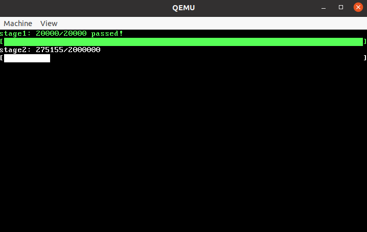

<div align='center'>
    <font size='6'>实验六 fork和进程树</font>
</div>

<div align='center'>
    <font size='4'>谷建华</font>
</div>

<div align='center'>
    <font size='4'>2022-11-14 v0.1</font>
</div>

#### 实验目的

1. 学习fork进程复制的原理和实现细节.
2. 学习进程树以理解进程间父子关系.
3. 学习简单的并发控制,内存资源管理.

#### 实验预习内容

1. fork、wait、exit系统调用基本语义和相互依赖关系.
2. 进程树结构.
3. 并发控制,理解互斥锁,关中断对内核执行流的影响.

#### 实验内容

1. 编写fork系统调用.
   (1) 编写fork系统调用,使调用者能够复制进程.
   (2) 在fork基本语义的实现的同时,需要考虑一种边界情况,当内核pcb资源满了（这次实验内核pcb资源只有20个）无法再分配时如何处理？这个需要你自行阅读手册`man 2 fork`（这个2什么意思可以看手册的手册`man man`,它会告诉你答案）了解怎么处理这个细节.
   (3) exec系统调用已经由我们实现好了,修改`main.c`中的`do_exec`函数调用参数变为`"testfork.bin"`,测试fork是否如预期复制了进程,复制出的两个进程并发着运行.
2. 编写wait系统调用.
   (1) 编写wait系统调用,使调用者在调用时会遍历它的所有子进程,如果有僵尸子进程则将其回收,将子进程状态返回,否则该进程变成睡眠状态直到有子进程exit将其唤醒.
   (2) 你在写wait基本语义的同时,需要考虑一种边界情况,当调用者进程没有子进程时如何处理？这个需要你自行阅读手册`man 2 wait`了解怎么处理这个细节.
   (3) exit系统调用已经由我们实现好了,修改`main.c`中的`do_exec`函数调用参数变为`"initproc.bin"`,这是OS的初始进程,它会fork出一个新进程并exec成`"shell.bin"`执行shell程序后永远不停地执行wait系统,shell大家做课内实验的时候已经实现了,现在你需要以内核的视角实现以支持shell的系统调用.
   (4) `testwait.bin`是一个用于检测你实现的fork、wait的功能正确性的用户程序,你可以通过shell调用它,如果不爆panic则你实现的功能全通过.
3. fork炸弹测试
   (1) 如果光实现功能,那还算简单,但是实际上操作系统很大的难点不在于实现**出**功能,而是实现**对**功能,能够经受系统中运行的各种复杂环境的考验,并发控制和资源管理对一个操作系统尤为重要.
   (2) `forkbomb.bin`是一个用于测试fork、wait和exit的程序,里面会不断随机调用fork、wait和exit系统调用达成fork炸弹的目的,你需要成功运行fork系统调用20000（两万）次（内核pcb的数量**必须**为20个）,内核中会有一段专门的程序检测fork的次数.测试通过的效果图如下：
    
   (3) （自我提高内容,自己想做就做,不用写进报告,**禁止内卷**）上面的两万次还算小打小闹,检验内核程序基本的并发控制和资源管理,而这次需要你成功运行fork系统调用2000000（两百万）次,预计耗时若干小时,这基本上能将你实现的系统调用的并发问题都暴露出来,虽然关中断很有效,但是希望你在做这个实验的时候能尽量少关,尽可能将你的并发问题暴露出来,如果你通过了这个测试就能看到我们准备的小彩蛋.

#### 实验总结

1. 进程树算是相当经典的描述进程关系的框架,但是如果不允许用进程树这个框架,意味着没有父子进程关系,你会怎么去设计进程的创建与销毁？（开放性答案,不要觉得自己做法低级,放心大胆往上写,任何言之有理的答案都行）
2. 在这次实验的时候你遇到了什么离谱的并发bug？（可以写没有,如果没有,那么恭喜你,你是一个严谨的人,你考虑问题非常周全）

#### 实验指导

##### fork-状态机模型

经过前几个实验的实践,我们从一个内核的视角看向用户程序可以逐渐隐约感觉到用户程序是一个状态机.具体什么意思,可以看回pcb中存储的用户寄存器.

```c
struct user_context {
    u32 gs;
    u32 fs;
    u32 es;
    u32 ds;
    u32 edi;
    u32 esi;
    u32 ebp;
    u32 kernel_esp;
    u32 ebx;
    u32 edx;
    u32 ecx;
    u32 eax;
    u32 retaddr;
    u32 eip;
    u32 cs;
    u32 eflags;
    u32 esp;
    u32 ss;
};
```

`cs,ds,es,fs,gs,ss,eax,ebx,ecx,edx,esi,edi,ebp,esi,eip,eflags`这些用户寄存器就可以描述用户当前的运行状态,再结合用户程序的页表（pcb中的cr3变量）,也就是用户程序能够访问的内存.这些对于一个用户程序来说就是它能够**直接**控制的所有信息.其余信息需要通过系统调用向内核申请服务获悉.

用户程序在执行的时候pc执行的汇编命令可以先简单抽象为三种形式：

1. 修改寄存器
2. 修改内存
3. 系统调用等其余指令

也就是说如果不考虑第三种形式（下面都暂时不考虑）,仅考虑用户程序由前两种形式的汇编指令组成,给用户进程指定的用户寄存器信息和内存,这个用户进程的执行过程可以**唯一确定**.

举个简单的例子,假设一个人要涂一面墙（内存）,人手里有把刷子（寄存器）,人可以进行下面两个操作之一（汇编指令）：

1. 将刷子的颜色调成指定颜色
2. 往墙上某个区域用刷子涂上颜色,墙上原有的部分的颜色会被覆盖

假设给人固定好初始的刷子颜色、墙面颜色（颜色可能五花八门）和操作序列,那么每一次操作后墙面颜色和刷子颜色是可以**唯一确定**的.可以通过数学归纳法证明经过若干次操作后墙面颜色和刷子颜色我们也是可以**唯一确定**的.

所以对于一个用户进程,可以将它的寄存器信息和内存信息抽象成用户程序的<u>状态</u>,而汇编指令就是一个映射方法,它将用户程序从一个<u>状态</u>映射到另一个<u>状态</u>.只要给定初始寄存器信息和内存信息,并确定执行流（汇编指令序列）,那么执行流中任意一环的程序<u>状态</u>我们都是可以**唯一确定**的,这就是**状态机模型**.

接下来回到第三种形式的汇编指令`系统调用等其余指令`,第三种形式指令本质上也是对用户寄存器和内存修改的指令,系统调用根据pcb中的信息反馈给用户,由于pcb对用户是不可见的,所以在用户视角下这个指令是不可预测的,意味着在用户视角下这条指令会发生什么是不可唯一确定的.而当我们将视角从用户移到内核,甚至硬件（某些指令是跟硬件交互的）,当我们知道的信息越多,用户指令执行后的状态总是可以**唯一确定**的.

##### fork-状态机复制

在讲完状态机模型后fork就比较好理解了,我们根据状态机模型可知,如果给定确定的寄存器信息和内存信息,用户程序的执行状态是可以唯一确定的（假设没有系统调用这种对用户程序来说**不可唯一确定**的指令）.

fork本质上就是对**状态机的复制**,当用户进程fork的时候,内核会新创建一个pcb,将当前进程的所有状态机信息原封不动地复制一份,也就是将当前进程的用户寄存器和内存原封不动复制一份给新的进程.

在复制完状态机信息后产生了两个进程,这两个进程的内存信息和寄存器信息**完全一样**,所以之后的执行流,用户程序状态机也会**完全一致**（直到第一次遇到系统调用这种指令）,这样就通过一个进程fork出两个进程.

##### fork-进程树

fork能够一模一样复制一份进程的状态机,但是实际上这终究是两个独立的进程,调用fork系统调用的进程被称为父进程,在fork中新创建的进程称为子进程.这样除了初始进程（pid号为0）,每个进程都有它的父进程,从数据结构的视角下进程之间的父子关系能够构成一个以0号进程为根的进程树.

这样进程每次执行fork后,该进程在进程树上会新增一个儿子节点,这个儿子节点指向的进程是fork新被创建的进程.

##### fork-父子进程返回值

这属于是大家在做上课就已经需要搞明白的东西,为了能够区分fork完后进程是父进程还是子进程,从它的返回值判断,如果返回值为0,则执行流获悉它是子进程,否则返回值为子进程的pid号,执行流获悉它是父进程.

##### exit

上面提到的进程树不只是用于描述进程之间的关系,与之关系密切的是exit和wait系统调用,相信大家在课内实验写简易shell的时候用到了fork,exec,wait这三个系统调用,然后还有一个系统调用exit被隐式调用了,被隐藏在了main函数中的返回值中.

##### exit-用户程序执行的终点

我们先随便编写一个`hello_world`程序,然后通过`strace`命令查看执行所用到的系统调用.

```
$ ls  
hello_world  hello_world.c
$ cat ./hello_world.c
#include <stdio.h>

int main()
{
	puts("hello world!");
	return 114;
}
$ strace ./hello_world
... # 太长了就不展示上面的了
write(1, "hello world!\n", 13hello world!
)          = 13
exit_group(114)                         = ?
+++ exited with 114 +++
```

可以看到用户程序在执行完exit（exit_group系统调用与线程相关,但这次实验没有线程的概念,所以可以简单理解为exit）后用户程序就停止运行了,而main中的返回值114也写入到exit系统调用的参数中了.

##### exit-程序的第一条指令和最后一条指令

在我们初学编程的时候肯定会有一个潜意识就是程序的第一条指令在main函数,这对初学者来说肯定是这样的,也很符合我们的直觉,觉得第一条指令在main函数.

不过这只是编译器给我们的错觉,实际上在进入main函数之前和结束main函数跳出之后程序实际上还是做了很多事的,在进入main函数之前会初始化很多东西,在结束了main函数跳出之后程序需要将很多在缓冲区的数据及时推送到内核,最后调用exit系统调用结束程序的执行.

在MINIOS中,用户程序的开始并不在main函数,由于`ld`工具默认`_start`是elf文件运行的程序入口,所以在`lib/user/astart.asm`存放着真正的用户程序入口,就是简单的调用了main,等main函数退出后eax寄存器存放着的是main函数的返回值,将eax作为参数调用exit函数结束程序的运行.虽然这个`_start`函数非常简单,但是还是能够作为一个例子证明main函数并不是程序运行的入口.

```nasm
[section .text]

extern main
extern exit
global _start

_start:			; 第一条指令
	call	main
	push	eax
	call	exit
```

##### exit-具体语义

通过实例可以发现exit系统调用实际上是一个进程的终止,通过翻阅linux手册`man 2 _exit`（这个2什么意思可以看手册的手册`man man`,它会告诉你答案）.里面有三段话能够帮助我们理解exit系统调用的具体语义.

```
The function _exit() terminates the calling process "immediately".  Any
open file descriptors belonging to the process are closed.   Any  chil‐
dren  of  the process are inherited by init(1) (or by the nearest "sub‐
reaper"  process  as  defined  through  the   use   of   the   prctl(2)
PR_SET_CHILD_SUBREAPER  operation).   The  process's  parent  is sent a
SIGCHLD signal.

The value status & 0xFF is  returned  to  the  parent  process  as  the 
process's  exit  status,  and can be collected using one of the wait(2) 
family of calls.

These functions do not return.
```

从这段话中可以知道实现exit系统调用需要注意的事情：

+ exit没有返回值,执行完后进程结束它的生命周期.
+ 如果有子进程还未被回收,这些子进程全部会被转移到初始进程下成为初始进程的子进程.（否则这个进程退出后这些子进程的父进程就不见了,这个肯定是不允许的,而初始进程肯定是活着的,交给它刚刚好）
+ 父进程会收到一个SIGCHLD信号（信号这个实验不谈,可以简单理解为唤醒父进程）.
+ exit中的参数会取其低8位（这是很多博客不会讲到的,只有查手册才能搞明白具体的语义）作为返回参数传递给父进程.
+ 父进程需要调用wait这类的系统调用获取该进程的exit参数.

通过这些信息可以提炼出exit这个系统调用需要做的事:

+ 变成僵尸进程,状态置为ZOMBIE（进程的生命周期已经结束了,它已经是个将死之"人"了,但是没有被父进程回收.所以就成了僵尸,不能运行但是就占着一部分资源）.
+ 将所有子进程的父进程变成初始进程（学术名词叫托孤,还是挺有诗意的）.
+ 处理exit参数.
+ 将部分资源回收（某些资源回收需要父进程完成）.
+ 唤醒父进程.

##### wait

理解wait最重要的是需要先理解exit,wait这个系统调用的语义就如它的英文语义一样,就一个字：“等”.这个系统调用实际上就是在等待任意子进程exit,如果有子进程状态是ZOMBIE就回收子进程资源返回子进程状态.如果当前没有子进程可以回收,就进入SLEEP状态等待子进程exit唤醒该进程.

如果你顺着上面的指导和exit的语义思考可以得出对wait系统调用的实现的一个模糊的映像,可以知道它大概需要做什么,但是可能一些实现细节不是很清楚.不过在这次不能一步步全部引导你什么地方要做什么,这次需要你自己去查手册`man 2 wait`去仔细阅读理解wait这个系统调用的具体语义设计出一个符合语义的系统调用程序,要学会查手册,不是全部读一遍跟背诵默写一样,而是挑你需要的看,大概需要看50~60行英文.

##### 并发

指导的最后一个部分交给并发部分,并发这玩意在上课的前几节讲概念的时候你们会感觉还好,并发就是一段时间内同时做几件事.但是真正遇到并发问题的时候你们就不会这么想了,并发能够带来非常多的问题,可以说是很多是让你摸不着头脑的问题.

因为MINIOS内核态允许中断,所以很多时候在执行内核程序时会发生调度,这会导致多个内核进程在一个时间段同时执行的并发场景,这会导致一些非常诡异的并发问题.

讲一个实验设计中的例子,还记得实验五中`phy_malloc_4k`这个函数吗？在设计初期为了防止多个内核进程同时访问这个函数上了一个锁保证分配不会因为并发问题打架：

```c
phyaddr_t
phy_malloc_4k(void)
{
	assert(phy_malloc_4k_p < 128 * MB);
	while(xchg(&phy_malloc_4k_lock, 1) == 1)
		schedule();

	phyaddr_t addr = phy_malloc_4k_p;
	phy_malloc_4k_p += PGSIZE;
free:
	xchg(&phy_malloc_4k_lock, 0);
	return addr;
}
```

但是在测试的时候发生了一件诡异的事,这个函数分配了一个128MB~128MB+4KB的物理页面出去然后内核在用的时候触发了page fault.在设计的时候挠了半天头,想不明白怎么能分配这么一个离谱的页面.

在仔细想了想之后搞明白了出问题的原因,第一个进程在争取到锁之后在`phy_malloc_4k_p += PGSIZE;`这句执行之前触发了调度,然后第二个进程在调用这个函数的时候成功躲过了assert语句的判断.调度回第一个进程把`phy_malloc_4k_p`更新,相当于第二个进程在执行assert语句的时候拿的是变量的旧值,没有拿新值判断,这个时候`phy_malloc_4k_p`的值可能是128MB,所以导致能够分配128MB~128MB+4KB这么一个离谱的物理页面.

所以正确的做法是将这个assert函数移到锁的临界区内,保证在临界区内值的判断是正确的.

```c
phyaddr_t
phy_malloc_4k(void)
{
	while(xchg(&phy_malloc_4k_lock, 1) == 1)
		schedule();
	assert(phy_malloc_4k_p < 128 * MB);

	phyaddr_t addr = phy_malloc_4k_p;
	phy_malloc_4k_p += PGSIZE;
free:
	xchg(&phy_malloc_4k_lock, 0);
	return addr;
}
```

##### 并发-一把大锁保平安

在并发面前,很多事情非常难以预料,我们人脑计算能力是非常渺小的,无法考虑那么全面.能够做的只能一把大锁保平安,简单来说,如果一个执行流需要访问/修改某一公共资源时,就需要给公共资源加上一个锁使用`xchg`原子指令进行上互斥锁进入临界区,防止公共资源同时被其他执行流访问/修改的情况.

##### 并发-多把大锁保平安？

在实际实践的时候,执行流可能需要访问多个公共资源,比如exit就需要访问三个pcb的锁,fork和wait需要访问两个pcb的锁,这就意味我们可能要上多把锁.

如果上一把互斥锁那还好处理,执行流要么进入临界区要么没进去,如果上多把锁就又涉及到上锁这个行为本身的并发问题,考虑一个情况：

两个执行流,第一个要先给a上锁再给b上锁,第二个要先给b上锁再给a上锁,然后一个可能的情况就是第一个执行流给a上完锁之后马上发生了调度,然后调度到第二个执行流,第二个执行流给b上完锁了发现a被上锁了于是就在等,然后调度回第一个执行流,第一个执行流发现b被上了锁,于是也在等.于是这两个执行流等到天荒地老也没等到对面释放锁.

对于这个问题的解决有一种办法,就是协商好上锁顺序,如果两个执行流都按照ab或ba的上锁顺序就能保证至少一个执行流能够运作,当一个执行流执行完释放完锁后另一个执行流再上锁.

##### 并发-实验六的上锁顺序

对于此次实验来说,需要上多把锁的场景有fork,exit和wait,这些场景都需要对进程pcb上锁,所以这里需要协商规范一下上锁顺序.

上锁规范是以进程树的0号进程为根,上锁顺序从根到叶子,就是说对于一个进程如果它,它祖宗,它儿子都需要被上锁,那么上锁顺序必须为祖宗->该节点->儿子.这种上锁方式能够保证上锁的节点在进程树中是深度递增的,无论什么情况都能保证至少一个执行流能够正常运行,不过这里暂且不证明.